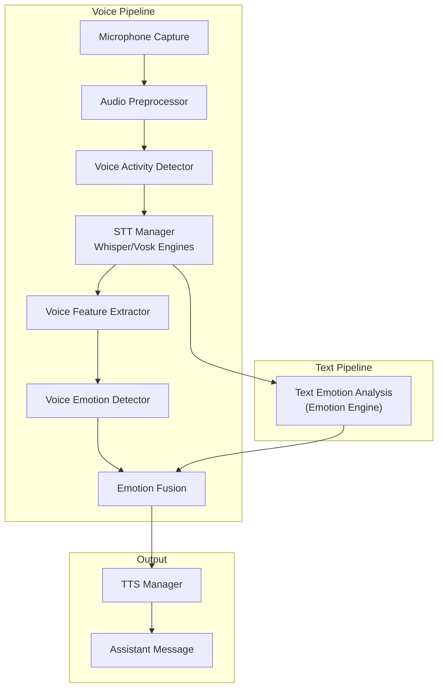
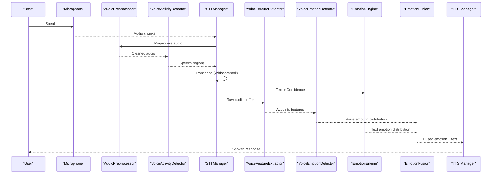
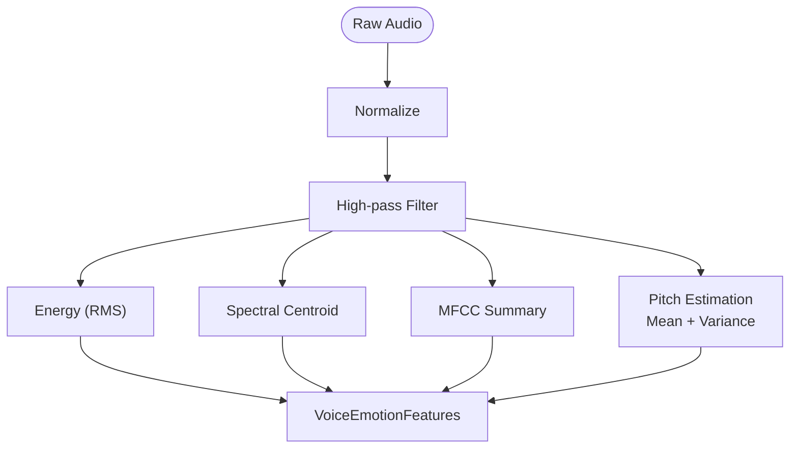
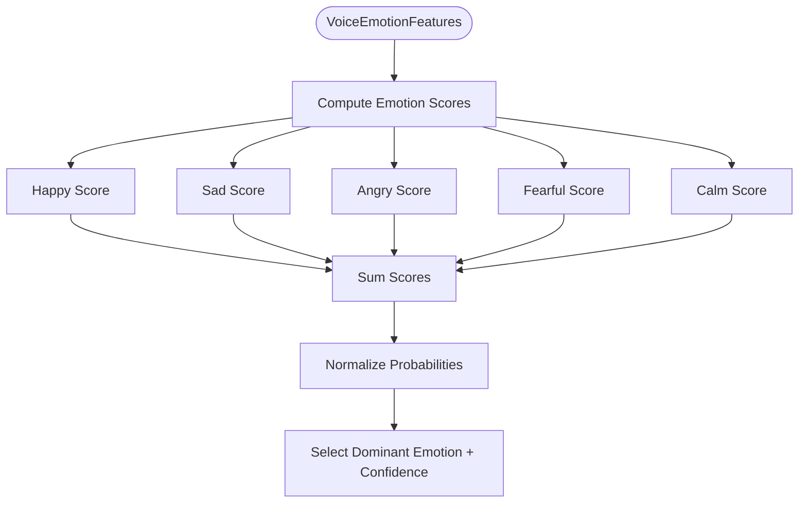
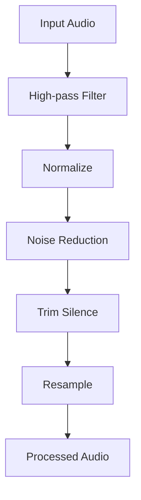
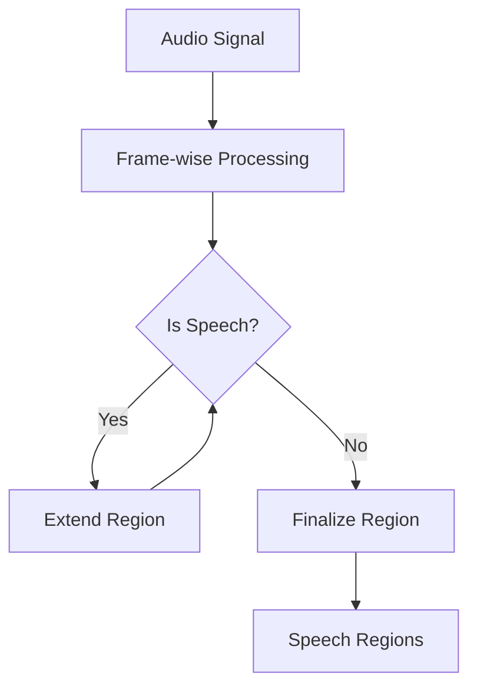
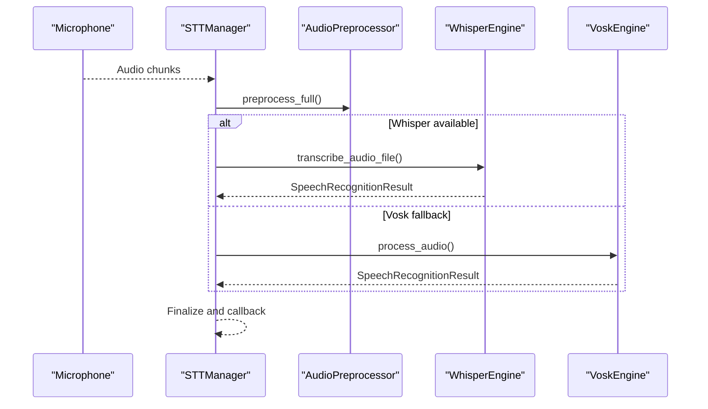
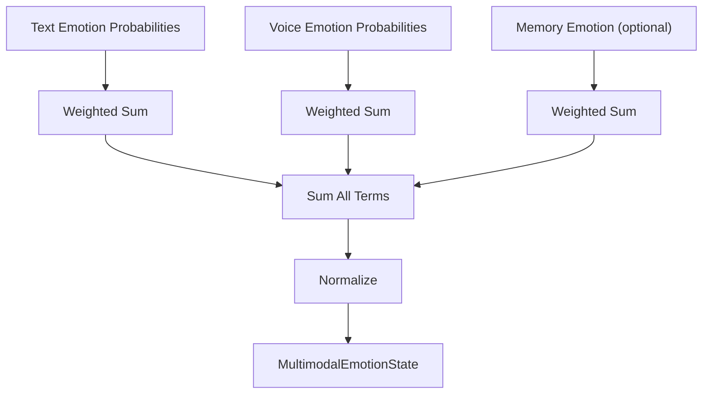
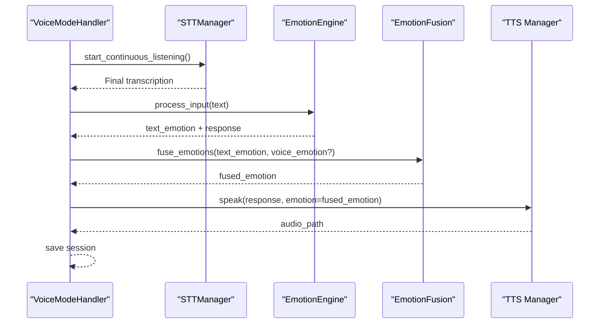
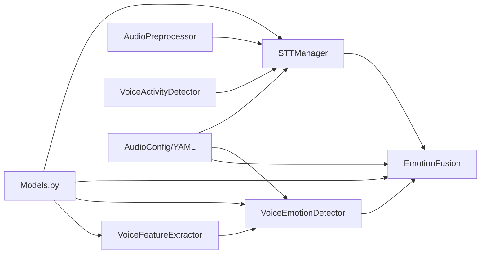

# Voice Emotion Detection

<cite>
**Referenced Files in This Document**
- [voice_emotion_analyzer.py](file://psychologist/emotion_engine/voice_emotion/voice_emotion_analyzer.py)
- [voice_emotion_detector.py](file://psychologist/emotion_engine/voice_system/voice_emotion_detector.py)
- [voice_feature_extractor.py](file://psychologist/emotion_engine/voice_system/voice_feature_extractor.py)
- [audio_preprocessor.py](file://psychologist/emotion_engine/voice_system/audio_preprocessor.py)
- [microphone.py](file://psychologist/emotion_engine/voice_system/microphone.py)
- [models.py](file://psychologist/emotion_engine/voice_system/models.py)
- [audio_config.py](file://psychologist/emotion_engine/voice_system/audio_config.py)
- [stt_manager.py](file://psychologist/emotion_engine/voice_system/stt_manager.py)
- [vad.py](file://psychologist/emotion_engine/voice_system/vad.py)
- [voice_config.yaml](file://config/voice_config.yaml)
- [emotion_fusion.py](file://psychologist/emotion_engine/voice_system/emotion_fusion.py)
- [emotion_state_machine.py](file://psychologist/emotion_engine/state_machine/emotion_state_machine.py)
- [emotion_engine.py](file://psychologist/emotion_engine/emotion_engine.py)
- [voice_mode_handler.py](file://psychologist/emotion_engine/interaction/voice_mode_handler.py)
- [whisper_engine.py](file://psychologist/emotion_engine/voice_system/whisper_engine.py)
- [vosk_engine.py](file://psychologist/emotion_engine/voice_system/vosk_engine.py)
</cite>

## Table of Contents
1. [Introduction](#introduction)
2. [Project Structure](#project-structure)
3. [Core Components](#core-components)
4. [Architecture Overview](#architecture-overview)
5. [Detailed Component Analysis](#detailed-component-analysis)
6. [Dependency Analysis](#dependency-analysis)
7. [Performance Considerations](#performance-considerations)
8. [Troubleshooting Guide](#troubleshooting-guide)
9. [Conclusion](#conclusion)
10. [Appendices](#appendices)

## Introduction
This document describes the Voice Emotion Detection system within the broader emotion processing framework. It explains how vocal characteristics (pitch, tone, rhythm, and prosody) are extracted and analyzed to infer emotional states, how the voice emotion detector integrates with the main emotion processing pipeline, and how real-time inference is supported. It also documents the mathematical foundations underpinning voice analysis (spectrogram processing, fundamental frequency analysis, and temporal pattern recognition), configuration options for emotion detection models and sensitivity tuning, and practical troubleshooting tips for accuracy issues.

## Project Structure
The voice emotion subsystem is organized around reusable components:
- Feature extraction and preprocessing for audio signals
- Voice emotion detection based on extracted acoustic features
- Speech-to-text engines (STT) to complement textual emotion analysis
- Voice activity detection (VAD) to segment speech
- Emotion fusion combining voice and text signals
- Interaction orchestration for voice mode
- Configuration and models shared across components

**Diagram sources**
- [microphone.py:14-95](file://psychologist/emotion_engine/voice_system/microphone.py#L14-L95)
- [audio_preprocessor.py:7-66](file://psychologist/emotion_engine/voice_system/audio_preprocessor.py#L7-L66)
- [vad.py:7-50](file://psychologist/emotion_engine/voice_system/vad.py#L7-L50)
- [stt_manager.py:17-104](file://psychologist/emotion_engine/voice_system/stt_manager.py#L17-L104)
- [whisper_engine.py:13-65](file://psychologist/emotion_engine/voice_system/whisper_engine.py#L13-L65)
- [vosk_engine.py:13-89](file://psychologist/emotion_engine/voice_system/vosk_engine.py#L13-L89)
- [voice_feature_extractor.py:11-62](file://psychologist/emotion_engine/voice_system/voice_feature_extractor.py#L11-L62)
- [voice_emotion_detector.py:6-53](file://psychologist/emotion_engine/voice_system/voice_emotion_detector.py#L6-L53)
- [emotion_fusion.py:7-49](file://psychologist/emotion_engine/voice_system/emotion_fusion.py#L7-L49)
- [emotion_engine.py:23-184](file://psychologist/emotion_engine/emotion_engine.py#L23-L184)

**Section sources**
- [voice_mode_handler.py:28-305](file://psychologist/emotion_engine/interaction/voice_mode_handler.py#L28-L305)
- [models.py:8-108](file://psychologist/emotion_engine/voice_system/models.py#L8-L108)

## Core Components
- VoiceFeatureExtractor: Computes pitch statistics, energy, spectral centroid, MFCC summary, intensity, speaking rate, and silence ratio from raw audio.
- VoiceEmotionDetector: Translates acoustic features into emotion probabilities using rule-based scoring and normalization.
- AudioPreprocessor: Applies high-pass filtering, normalization, noise reduction, silence trimming, and resampling.
- VoiceActivityDetector: Frames audio and detects speech/non-speech regions.
- STTManager: Orchestrates microphone capture, preprocessing, and transcription via Whisper/Vosk.
- EmotionFusion: Combines text-emotion and voice-emotion distributions into a multimodal fused emotion.
- VoiceModeHandler: Integrates voice capture, STT, emotion fusion, safety checks, and TTS output.
- Configuration: Centralized YAML configuration for voice emotion weights, thresholds, and privacy settings.

**Section sources**
- [voice_feature_extractor.py:11-62](file://psychologist/emotion_engine/voice_system/voice_feature_extractor.py#L11-L62)
- [voice_emotion_detector.py:6-53](file://psychologist/emotion_engine/voice_system/voice_emotion_detector.py#L6-L53)
- [audio_preprocessor.py:7-66](file://psychologist/emotion_engine/voice_system/audio_preprocessor.py#L7-L66)
- [vad.py:7-50](file://psychologist/emotion_engine/voice_system/vad.py#L7-L50)
- [stt_manager.py:17-104](file://psychologist/emotion_engine/voice_system/stt_manager.py#L17-L104)
- [emotion_fusion.py:7-49](file://psychologist/emotion_engine/voice_system/emotion_fusion.py#L7-L49)
- [voice_mode_handler.py:28-305](file://psychologist/emotion_engine/interaction/voice_mode_handler.py#L28-L305)
- [audio_config.py:11-101](file://psychologist/emotion_engine/voice_system/audio_config.py#L11-L101)
- [voice_config.yaml:1-28](file://config/voice_config.yaml#L1-L28)

## Architecture Overview
The voice emotion pipeline transforms raw audio into actionable emotional insights and integrates seamlessly with text-based emotion analysis and response generation.

**Diagram sources**
- [microphone.py:14-95](file://psychologist/emotion_engine/voice_system/microphone.py#L14-L95)
- [audio_preprocessor.py:57-66](file://psychologist/emotion_engine/voice_system/audio_preprocessor.py#L57-L66)
- [vad.py:28-49](file://psychologist/emotion_engine/voice_system/vad.py#L28-L49)
- [stt_manager.py:44-101](file://psychologist/emotion_engine/voice_system/stt_manager.py#L44-L101)
- [whisper_engine.py:43-63](file://psychologist/emotion_engine/voice_system/whisper_engine.py#L43-L63)
- [vosk_engine.py:54-83](file://psychologist/emotion_engine/voice_system/vosk_engine.py#L54-L83)
- [voice_feature_extractor.py:13-60](file://psychologist/emotion_engine/voice_system/voice_feature_extractor.py#L13-L60)
- [voice_emotion_detector.py:8-51](file://psychologist/emotion_engine/voice_system/voice_emotion_detector.py#L8-L51)
- [emotion_engine.py:37-92](file://psychologist/emotion_engine/emotion_engine.py#L37-L92)
- [emotion_fusion.py:11-47](file://psychologist/emotion_engine/voice_system/emotion_fusion.py#L11-L47)
- [voice_mode_handler.py:145-277](file://psychologist/emotion_engine/interaction/voice_mode_handler.py#L145-L277)

## Detailed Component Analysis

### Voice Feature Extractor
The extractor computes robust acoustic descriptors:
- Pitch: Fundamental frequency estimation using harmonic peak tracking; aggregates mean and variance.
- Energy: Per-frame RMS energy averaged across the signal.
- Spectral centroid: A measure of timbral brightness.
- MFCC summary: First 13 MFCCs aggregated per channel.
- Intensity: Root-mean-square energy envelope.
- Speaking rate and silence ratio: Derived heuristics for prosodic analysis.

**Diagram sources**
- [voice_feature_extractor.py:13-60](file://psychologist/emotion_engine/voice_system/voice_feature_extractor.py#L13-L60)

**Section sources**
- [voice_feature_extractor.py:11-62](file://psychologist/emotion_engine/voice_system/voice_feature_extractor.py#L11-L62)
- [models.py:44-66](file://psychologist/emotion_engine/voice_system/models.py#L44-L66)

### Voice Emotion Detector
The detector translates acoustic features into emotion probabilities using weighted scoring:
- Happy: high pitch mean/variance, high energy
- Sad: low pitch mean/variance, low energy
- Angry: high pitch mean/variance, high energy
- Fearful: high pitch mean/variance, variable energy
- Calm: low pitch mean/variance, moderate energy

Scores are normalized to form a probability distribution and the dominant emotion is selected with confidence.

**Diagram sources**
- [voice_emotion_detector.py:8-51](file://psychologist/emotion_engine/voice_system/voice_emotion_detector.py#L8-L51)

**Section sources**
- [voice_emotion_detector.py:6-53](file://psychologist/emotion_engine/voice_system/voice_emotion_detector.py#L6-L53)
- [models.py:69-84](file://psychologist/emotion_engine/voice_system/models.py#L69-L84)

### Audio Preprocessor
Provides a configurable preprocessing chain:
- High-pass filtering to remove DC and low-frequency noise
- Normalization to prevent clipping
- Noise reduction via spectral subtraction-like technique
- Silence trimming to isolate speech segments
- Resampling to target sample rate

**Diagram sources**
- [audio_preprocessor.py:57-64](file://psychologist/emotion_engine/voice_system/audio_preprocessor.py#L57-L64)

**Section sources**
- [audio_preprocessor.py:7-66](file://psychologist/emotion_engine/voice_system/audio_preprocessor.py#L7-L66)

### Voice Activity Detector (VAD)
Segments continuous audio into speech regions using WebRTC VAD with configurable frame sizes and modes.

**Diagram sources**
- [vad.py:28-48](file://psychologist/emotion_engine/voice_system/vad.py#L28-L48)

**Section sources**
- [vad.py:7-50](file://psychologist/emotion_engine/voice_system/vad.py#L7-L50)

### STT Manager and Engines
Manages continuous listening, audio buffering, preprocessing, and transcription via Whisper (preferred) or Vosk (fallback). Provides callbacks for transcription results and activity logging.

**Diagram sources**
- [stt_manager.py:44-101](file://psychologist/emotion_engine/voice_system/stt_manager.py#L44-L101)
- [whisper_engine.py:43-63](file://psychologist/emotion_engine/voice_system/whisper_engine.py#L43-L63)
- [vosk_engine.py:54-83](file://psychologist/emotion_engine/voice_system/vosk_engine.py#L54-L83)

**Section sources**
- [stt_manager.py:17-104](file://psychologist/emotion_engine/voice_system/stt_manager.py#L17-L104)
- [whisper_engine.py:13-65](file://psychologist/emotion_engine/voice_system/whisper_engine.py#L13-L65)
- [vosk_engine.py:13-89](file://psychologist/emotion_engine/voice_system/vosk_engine.py#L13-L89)

### Emotion Fusion
Combines text-emotion and voice-emotion distributions using configurable weights and normalizes the fused result. Provides a dominant emotion and confidence for downstream TTS and response generation.

**Diagram sources**
- [emotion_fusion.py:11-47](file://psychologist/emotion_engine/voice_system/emotion_fusion.py#L11-L47)
- [models.py:88-106](file://psychologist/emotion_engine/voice_system/models.py#L88-L106)

**Section sources**
- [emotion_fusion.py:7-49](file://psychologist/emotion_engine/voice_system/emotion_fusion.py#L7-L49)
- [audio_config.py:30-37](file://psychologist/emotion_engine/voice_system/audio_config.py#L30-L37)
- [voice_config.yaml:21-28](file://config/voice_config.yaml#L21-L28)

### Voice Mode Handler Integration
Coordinates the end-to-end voice interaction:
- Starts/stops listening, captures audio, and triggers STT
- Performs safety assessment and text emotion analysis
- Optionally integrates voice emotion features (placeholder for future audio-based features)
- Fuses text and voice emotions, generates a response, and speaks via TTS
- Saves messages and updates session state

**Diagram sources**
- [voice_mode_handler.py:76-277](file://psychologist/emotion_engine/interaction/voice_mode_handler.py#L76-L277)
- [emotion_engine.py:37-92](file://psychologist/emotion_engine/emotion_engine.py#L37-L92)
- [emotion_fusion.py:11-47](file://psychologist/emotion_engine/voice_system/emotion_fusion.py#L11-L47)

**Section sources**
- [voice_mode_handler.py:28-305](file://psychologist/emotion_engine/interaction/voice_mode_handler.py#L28-L305)

### Mathematical Foundations
- Spectrogram processing: Short-Time Fourier Transform (STFT) implicitly used in librosa-based features (e.g., spectral centroid, MFCCs). Windowing and overlap define frequency resolution and temporal smoothing.
- Fundamental frequency (F0) analysis: Harmonic peak tracking identifies dominant periodicity; mean and variance quantify pitch central tendency and variability.
- Temporal pattern recognition: Energy envelopes, silence detection, and speaking rate metrics capture rhythm and prosody.
- Statistical normalization: Min-max scaling and softmax normalization ensure comparable scales across heterogeneous features.

**Section sources**
- [voice_feature_extractor.py:19-54](file://psychologist/emotion_engine/voice_system/voice_feature_extractor.py#L19-L54)
- [voice_emotion_detector.py:19-32](file://psychologist/emotion_engine/voice_system/voice_emotion_detector.py#L19-L32)

### Configuration Options
Key configuration keys for voice emotion:
- voice_emotion.enabled: Enable/disable voice emotion analysis
- voice_emotion.fusion_enabled: Enable/disable multimodal fusion
- voice_emotion.text_weight: Weight for text-emotion contribution
- voice_emotion.voice_weight: Weight for voice-emotion contribution
- voice_emotion.memory_weight: Weight for memory-emotion contribution
- voice_emotion.confidence_threshold: Minimum confidence for accepting fused emotion
- privacy.offline_only, privacy.allow_cloud_audio, privacy.store_audio_files: Privacy and storage preferences

These are loaded from the centralized YAML configuration and exposed via the AudioConfig class.

**Section sources**
- [audio_config.py:11-101](file://psychologist/emotion_engine/voice_system/audio_config.py#L11-L101)
- [voice_config.yaml:1-28](file://config/voice_config.yaml#L1-L28)

## Dependency Analysis
The voice emotion system exhibits layered dependencies:
- Data models define feature/result structures used across components.
- Preprocessing and VAD depend on NumPy and SciPy/SciPy.signal.
- Feature extraction depends on librosa.
- STT engines depend on faster-whisper and vosk.
- Fusion depends on configuration weights.
- Interaction orchestrator composes all components.

**Diagram sources**
- [models.py:8-108](file://psychologist/emotion_engine/voice_system/models.py#L8-L108)
- [voice_feature_extractor.py:11-62](file://psychologist/emotion_engine/voice_system/voice_feature_extractor.py#L11-L62)
- [voice_emotion_detector.py:6-53](file://psychologist/emotion_engine/voice_system/voice_emotion_detector.py#L6-L53)
- [emotion_fusion.py:7-49](file://psychologist/emotion_engine/voice_system/emotion_fusion.py#L7-L49)
- [stt_manager.py:17-104](file://psychologist/emotion_engine/voice_system/stt_manager.py#L17-L104)
- [audio_config.py:11-101](file://psychologist/emotion_engine/voice_system/audio_config.py#L11-L101)

**Section sources**
- [models.py:8-108](file://psychologist/emotion_engine/voice_system/models.py#L8-L108)
- [audio_config.py:11-101](file://psychologist/emotion_engine/voice_system/audio_config.py#L11-L101)

## Performance Considerations
- Latency: Prefer streaming STT engines (e.g., Vosk) for lower latency; Whisper offers higher accuracy but requires file I/O overhead.
- CPU/GPU: Whisper initialization supports device selection; adjust compute type for resource constraints.
- Sample rate: Ensure consistent sample rates across capture, preprocessing, and feature extraction to avoid resampling overhead.
- Memory: Keep audio buffers bounded; trim silence aggressively to reduce computation.
- Robustness: Apply high-pass filtering and noise reduction to improve pitch and MFCC stability.

[No sources needed since this section provides general guidance]

## Troubleshooting Guide
Common accuracy and integration issues:
- No audio available: Verify microphone permissions and device selection; confirm AudioAvailable flag and exception handling paths.
- Low-quality transcription: Adjust silence thresholds, enable high-pass filtering, and increase noise reduction strength.
- Misaligned emotions: Tune fusion weights and confidence thresholds; validate that voice features are computed from clean speech segments.
- Real-time responsiveness: Reduce chunk sizes and enable VAD to minimize false positives; consider switching to Vosk for continuous transcription.
- Model availability: Ensure faster-whisper or vosk is installed; otherwise, STTManager falls back gracefully.

**Section sources**
- [voice_emotion_analyzer.py:1-58](file://psychologist/emotion_engine/voice_emotion/voice_emotion_analyzer.py#L1-L58)
- [stt_manager.py:30-101](file://psychologist/emotion_engine/voice_system/stt_manager.py#L30-L101)
- [whisper_engine.py:24-42](file://psychologist/emotion_engine/voice_system/whisper_engine.py#L24-L42)
- [vosk_engine.py:25-52](file://psychologist/emotion_engine/voice_system/vosk_engine.py#L25-L52)
- [audio_preprocessor.py:16-29](file://psychologist/emotion_engine/voice_system/audio_preprocessor.py#L16-L29)
- [vad.py:14-26](file://psychologist/emotion_engine/voice_system/vad.py#L14-L26)
- [emotion_fusion.py:15-17](file://psychologist/emotion_engine/voice_system/emotion_fusion.py#L15-L17)

## Conclusion
The Voice Emotion Detection system combines robust audio preprocessing, librosa-based feature extraction, rule-based emotion scoring, and multimodal fusion to deliver interpretable emotional insights from speech. Its integration with the broader emotion processing pipeline ensures that voice-derived affect is harmonized with textual sentiment and contextual memory, enabling responsive, adaptive interactions. Configuration flexibility allows tuning for accuracy, privacy, and performance across diverse deployment scenarios.

[No sources needed since this section summarizes without analyzing specific files]

## Appendices

### Integration Examples
- Voice mode end-to-end: See VoiceModeHandler orchestration for capturing, transcribing, analyzing, fusing, and responding.
- Real-time inference: Use STTManager with Vosk for continuous listening and immediate feedback loops.
- Accuracy optimization: Increase noise reduction, enable high-pass filtering, and adjust fusion weights to align with domain-specific emotion profiles.

**Section sources**
- [voice_mode_handler.py:145-277](file://psychologist/emotion_engine/interaction/voice_mode_handler.py#L145-L277)
- [stt_manager.py:44-101](file://psychologist/emotion_engine/voice_system/stt_manager.py#L44-L101)
- [emotion_fusion.py:15-17](file://psychologist/emotion_engine/voice_system/emotion_fusion.py#L15-L17)