# Voice Processing System

<cite>
**Referenced Files in This Document**
- [voice_config.yaml](file://psychologist/config/voice_config.yaml)
- [tts_config.yaml](file://psychologist/config/tts_config.yaml)
- [single_voice_tts.yaml](file://psychologist/config/single_voice_tts.yaml)
- [interaction_config.yaml](file://psychologist/config/interaction_config.yaml)
- [safety_config.yaml](file://psychologist/config/safety_config.yaml)
- [__init__.py](file://psychologist/emotion_engine/voice_system/__init__.py)
- [audio_config.py](file://psychologist/emotion_engine/voice_system/audio_config.py)
- [audio_preprocessor.py](file://psychologist/emotion_engine/voice_system/audio_preprocessor.py)
- [vad.py](file://psychologist/emotion_engine/voice_system/vad.py)
- [microphone.py](file://psychologist/emotion_engine/voice_system/microphone.py)
- [vosk_engine.py](file://psychologist/emotion_engine/voice_system/vosk_engine.py)
- [whisper_engine.py](file://psychologist/emotion_engine/voice_system/whisper_engine.py)
- [stt_manager.py](file://psychologist/emotion_engine/voice_system/stt_manager.py)
- [voice_emotion_detector.py](file://psychologist/emotion_engine/voice_system/voice_emotion_detector.py)
- [emotion_fusion.py](file://psychologist/emotion_engine/voice_system/emotion_fusion.py)
- [voice_feature_extractor.py](file://psychologist/emotion_engine/voice_system/voice_feature_extractor.py)
- [base_tts_engine.py](file://psychologist/emotion_engine/voice_output/base_tts_engine.py)
- [piper_engine.py](file://psychologist/emotion_engine/voice_output/piper_engine.py)
- [espeak_engine.py](file://psychologist/emotion_engine/voice_output/espeak_engine.py)
- [pyttsx3_engine.py](file://psychologist/emotion_engine/voice_output/pyttsx3_engine.py)
- [tts_manager.py](file://psychologist/emotion_engine/voice_output/tts_manager.py)
- [voice_config.py](file://psychologist/emotion_engine/voice_output/voice_config.py)
- [voice_style_mapper.py](file://psychologist/emotion_engine/voice_output/voice_style_mapper.py)
- [audio_player.py](file://psychologist/emotion_engine/voice_output/audio_player.py)
- [voice_lock.py](file://psychologist/emotion_engine/voice_output/voice_lock.py)
- [models.py](file://psychologist/emotion_engine/voice_system/models.py)
- [models.py](file://psychologist/emotion_engine/voice_output/models.py)
- [voice_emotion_analyzer.py](file://psychologist/emotion_engine/voice_emotion/voice_emotion_analyzer.py)
</cite>

## Table of Contents
1. [Introduction](#introduction)
2. [Project Structure](#project-structure)
3. [Core Components](#core-components)
4. [Architecture Overview](#architecture-overview)
5. [Detailed Component Analysis](#detailed-component-analysis)
6. [Dependency Analysis](#dependency-analysis)
7. [Performance Considerations](#performance-considerations)
8. [Troubleshooting Guide](#troubleshooting-guide)
9. [Conclusion](#conclusion)
10. [Appendices](#appendices)

## Introduction
This document describes the Voice Processing System responsible for speech-to-text (STT), voice synthesis (TTS), voice activity detection (VAD), audio preprocessing, voice emotion detection and fusion, and real-time microphone integration. It explains the STT engines (Vosk and Whisper), TTS engines (Piper, eSpeak, pyttsx3), configuration options, and quality optimization techniques. It also covers the audio pipeline, emotion analyzer capabilities, and practical configuration and troubleshooting guidance.

## Project Structure
The voice system spans two primary packages:
- emotion_engine/voice_system: STT, VAD, audio preprocessing, microphone, models, and voice emotion fusion
- emotion_engine/voice_output: TTS engines, TTS manager, voice configuration, and audio playback

Key configuration files define privacy, STT/TTS defaults, voice emotion fusion weights, and interaction modes.

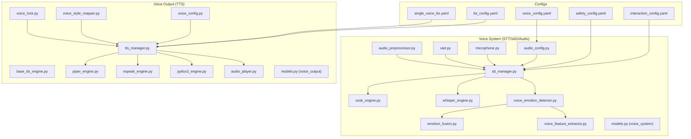

**Diagram sources**
- [audio_config.py:11-101](file://psychologist/emotion_engine/voice_system/audio_config.py#L11-L101)
- [microphone.py:14-95](file://psychologist/emotion_engine/voice_system/microphone.py#L14-L95)
- [vad.py:7-50](file://psychologist/emotion_engine/voice_system/vad.py#L7-L50)
- [audio_preprocessor.py:7-66](file://psychologist/emotion_engine/voice_system/audio_preprocessor.py#L7-L66)
- [stt_manager.py](file://psychologist/emotion_engine/voice_system/stt_manager.py)
- [vosk_engine.py](file://psychologist/emotion_engine/voice_system/vosk_engine.py)
- [whisper_engine.py](file://psychologist/emotion_engine/voice_system/whisper_engine.py)
- [voice_emotion_detector.py](file://psychologist/emotion_engine/voice_system/voice_emotion_detector.py)
- [emotion_fusion.py](file://psychologist/emotion_engine/voice_system/emotion_fusion.py)
- [voice_feature_extractor.py](file://psychologist/emotion_engine/voice_system/voice_feature_extractor.py)
- [tts_manager.py](file://psychologist/emotion_engine/voice_output/tts_manager.py)
- [base_tts_engine.py](file://psychologist/emotion_engine/voice_output/base_tts_engine.py)
- [piper_engine.py](file://psychologist/emotion_engine/voice_output/piper_engine.py)
- [espeak_engine.py](file://psychologist/emotion_engine/voice_output/espeak_engine.py)
- [pyttsx3_engine.py](file://psychologist/emotion_engine/voice_output/pyttsx3_engine.py)
- [voice_config.py](file://psychologist/emotion_engine/voice_output/voice_config.py)
- [voice_style_mapper.py](file://psychologist/emotion_engine/voice_output/voice_style_mapper.py)
- [audio_player.py](file://psychologist/emotion_engine/voice_output/audio_player.py)
- [voice_lock.py](file://psychologist/emotion_engine/voice_output/voice_lock.py)
- [models.py](file://psychologist/emotion_engine/voice_system/models.py)
- [models.py](file://psychologist/emotion_engine/voice_output/models.py)
- [voice_config.yaml:1-28](file://psychologist/config/voice_config.yaml#L1-L28)
- [tts_config.yaml:1-61](file://psychologist/config/tts_config.yaml#L1-L61)
- [single_voice_tts.yaml:1-69](file://psychologist/config/single_voice_tts.yaml#L1-L69)
- [interaction_config.yaml:1-60](file://psychologist/config/interaction_config.yaml#L1-L60)
- [safety_config.yaml:1-116](file://psychologist/config/safety_config.yaml#L1-L116)

**Section sources**
- [__init__.py:1-57](file://psychologist/emotion_engine/voice_system/__init__.py#L1-L57)
- [voice_config.yaml:1-28](file://psychologist/config/voice_config.yaml#L1-L28)
- [tts_config.yaml:1-61](file://psychologist/config/tts_config.yaml#L1-L61)
- [single_voice_tts.yaml:1-69](file://psychologist/config/single_voice_tts.yaml#L1-L69)
- [interaction_config.yaml:1-60](file://psychologist/config/interaction_config.yaml#L1-L60)
- [safety_config.yaml:1-116](file://psychologist/config/safety_config.yaml#L1-L116)

## Core Components
- Audio configuration loader and accessor for STT/TTS/voice emotion settings
- Microphone capture with level monitoring and chunked buffering
- Voice Activity Detection (WebRTC VAD) for speech/non-speech segmentation
- Audio preprocessing pipeline: normalization, noise reduction, high-pass filtering, silence trimming, resampling
- STT manager orchestrating Vosk and Whisper engines with fallback logic
- Voice emotion detector extracting acoustic features and classifying emotions
- Emotion fusion combining text, voice, and memory signals
- TTS manager implementing a factory pattern to select Piper/eSpeak/pyttsx3 engines
- Voice configuration and style mapper for dynamic prosody adjustments
- Audio player and voice lock for synchronized playback and voice selection

**Section sources**
- [audio_config.py:11-101](file://psychologist/emotion_engine/voice_system/audio_config.py#L11-L101)
- [microphone.py:14-95](file://psychologist/emotion_engine/voice_system/microphone.py#L14-L95)
- [vad.py:7-50](file://psychologist/emotion_engine/voice_system/vad.py#L7-L50)
- [audio_preprocessor.py:7-66](file://psychologist/emotion_engine/voice_system/audio_preprocessor.py#L7-L66)
- [stt_manager.py](file://psychologist/emotion_engine/voice_system/stt_manager.py)
- [voice_emotion_detector.py](file://psychologist/emotion_engine/voice_system/voice_emotion_detector.py)
- [emotion_fusion.py](file://psychologist/emotion_engine/voice_system/emotion_fusion.py)
- [tts_manager.py](file://psychologist/emotion_engine/voice_output/tts_manager.py)
- [voice_config.py](file://psychologist/emotion_engine/voice_output/voice_config.py)
- [voice_style_mapper.py](file://psychologist/emotion_engine/voice_output/voice_style_mapper.py)
- [audio_player.py](file://psychologist/emotion_engine/voice_output/audio_player.py)
- [voice_lock.py](file://psychologist/emotion_engine/voice_output/voice_lock.py)

## Architecture Overview
The system integrates real-time microphone input with STT and voice emotion detection, then routes synthesized responses through TTS with emotion-aware prosody.

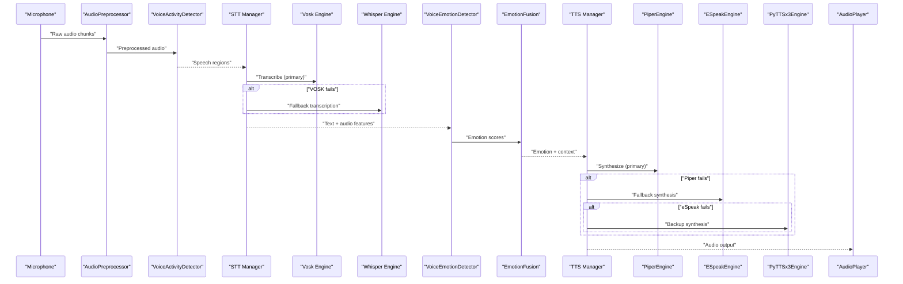

**Diagram sources**
- [microphone.py:14-95](file://psychologist/emotion_engine/voice_system/microphone.py#L14-L95)
- [audio_preprocessor.py:7-66](file://psychologist/emotion_engine/voice_system/audio_preprocessor.py#L7-L66)
- [vad.py:7-50](file://psychologist/emotion_engine/voice_system/vad.py#L7-L50)
- [stt_manager.py](file://psychologist/emotion_engine/voice_system/stt_manager.py)
- [vosk_engine.py](file://psychologist/emotion_engine/voice_system/vosk_engine.py)
- [whisper_engine.py](file://psychologist/emotion_engine/voice_system/whisper_engine.py)
- [voice_emotion_detector.py](file://psychologist/emotion_engine/voice_system/voice_emotion_detector.py)
- [emotion_fusion.py](file://psychologist/emotion_engine/voice_system/emotion_fusion.py)
- [tts_manager.py](file://psychologist/emotion_engine/voice_output/tts_manager.py)
- [piper_engine.py](file://psychologist/emotion_engine/voice_output/piper_engine.py)
- [espeak_engine.py](file://psychologist/emotion_engine/voice_output/espeak_engine.py)
- [pyttsx3_engine.py](file://psychologist/emotion_engine/voice_output/pyttsx3_engine.py)
- [audio_player.py](file://psychologist/emotion_engine/voice_output/audio_player.py)

## Detailed Component Analysis

### Audio Configuration
- Loads and persists YAML-based configuration for STT, TTS, voice emotion, and privacy
- Provides typed getters/setters for nested keys and default values
- Exposes convenience properties for default engines and emotion enablement

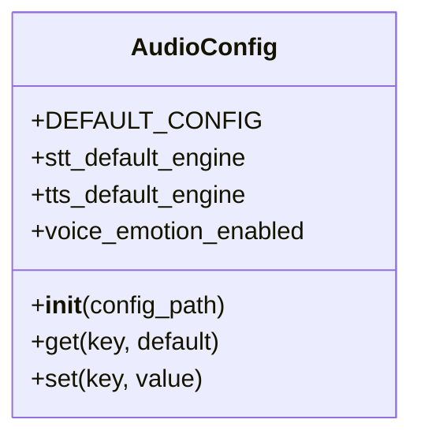

**Diagram sources**
- [audio_config.py:11-101](file://psychologist/emotion_engine/voice_system/audio_config.py#L11-L101)

**Section sources**
- [audio_config.py:11-101](file://psychologist/emotion_engine/voice_system/audio_config.py#L11-L101)
- [voice_config.yaml:1-28](file://psychologist/config/voice_config.yaml#L1-L28)
- [tts_config.yaml:1-61](file://psychologist/config/tts_config.yaml#L1-L61)
- [single_voice_tts.yaml:1-69](file://psychologist/config/single_voice_tts.yaml#L1-L69)

### Microphone Integration
- Enumerates input devices and opens a blocking stream via sounddevice
- Streams audio chunks into a thread-safe queue and computes RMS level
- Supports callbacks for level monitoring and safe shutdown

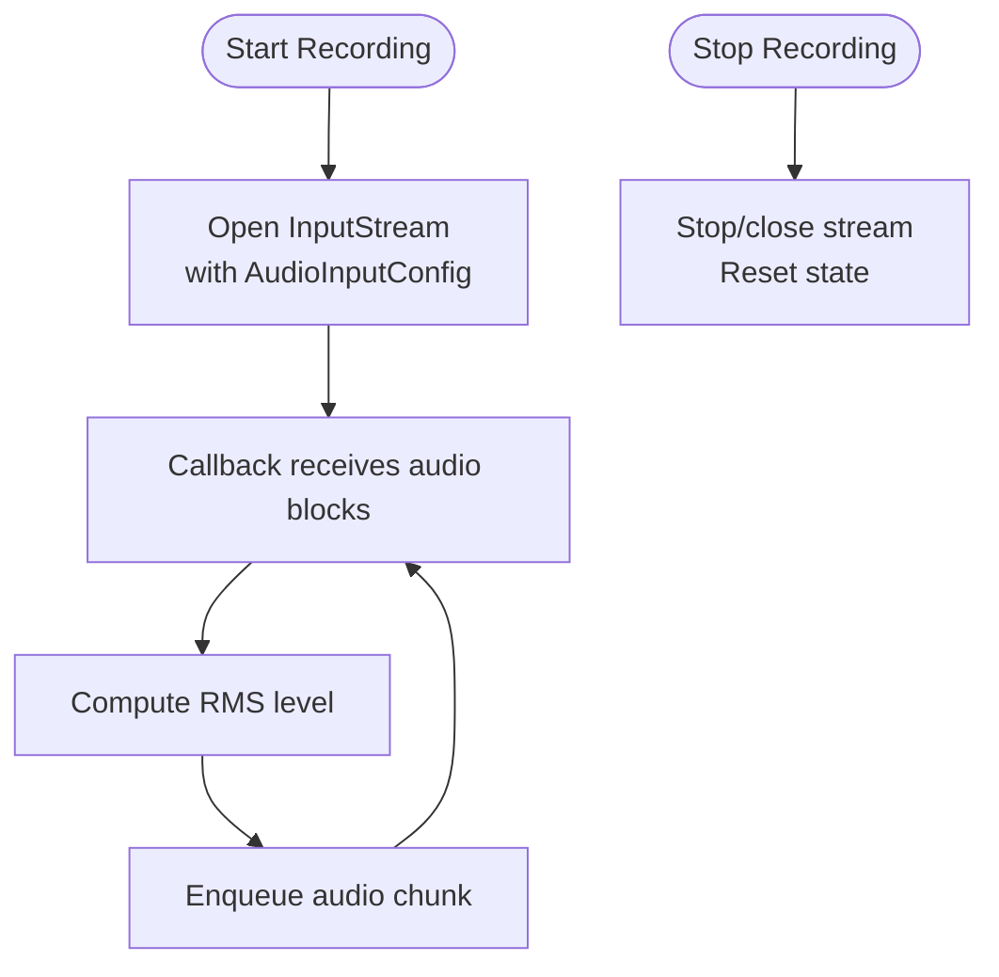

**Diagram sources**
- [microphone.py:14-95](file://psychologist/emotion_engine/voice_system/microphone.py#L14-L95)

**Section sources**
- [microphone.py:14-95](file://psychologist/emotion_engine/voice_system/microphone.py#L14-L95)
- [models.py](file://psychologist/emotion_engine/voice_system/models.py)

### Voice Activity Detection (VAD)
- Wraps WebRTC VAD with configurable mode, sample rate, and frame duration
- Provides per-frame speech detection and speech-region segmentation
- Ensures int16 conversion and frame padding/truncation

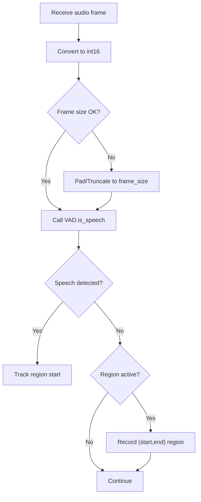

**Diagram sources**
- [vad.py:7-50](file://psychologist/emotion_engine/voice_system/vad.py#L7-L50)

**Section sources**
- [vad.py:7-50](file://psychologist/emotion_engine/voice_system/vad.py#L7-L50)

### Audio Preprocessing Pipeline
- Normalization to prevent clipping
- Spectral subtraction-like noise reduction using early segment statistics
- High-pass filtering to remove DC and low-frequency noise
- Silence trimming with configurable pre/post padding
- Resampling to target rate
- Full pipeline composition method

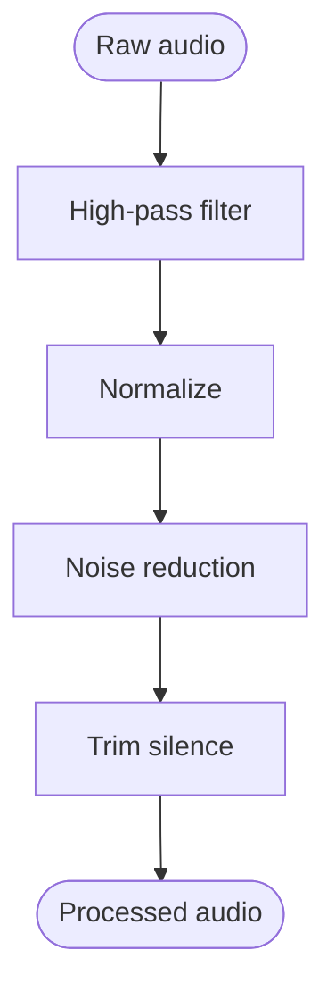

**Diagram sources**
- [audio_preprocessor.py:7-66](file://psychologist/emotion_engine/voice_system/audio_preprocessor.py#L7-L66)

**Section sources**
- [audio_preprocessor.py:7-66](file://psychologist/emotion_engine/voice_system/audio_preprocessor.py#L7-L66)

### Speech Recognition Engines (STT)
- STT Manager selects Vosk as primary and Whisper as fallback
- Vosk engine loads model and performs streaming/transcription
- Whisper engine supports local inference and fallback behavior
- Configuration controls default engine, language, sample rate, and continuous listening

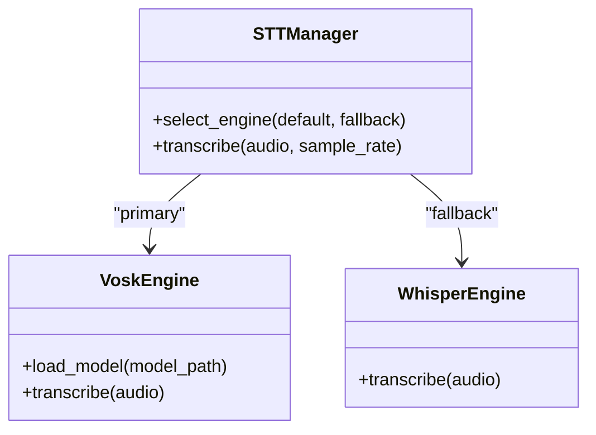

**Diagram sources**
- [stt_manager.py](file://psychologist/emotion_engine/voice_system/stt_manager.py)
- [vosk_engine.py](file://psychologist/emotion_engine/voice_system/vosk_engine.py)
- [whisper_engine.py](file://psychologist/emotion_engine/voice_system/whisper_engine.py)

**Section sources**
- [stt_manager.py](file://psychologist/emotion_engine/voice_system/stt_manager.py)
- [vosk_engine.py](file://psychologist/emotion_engine/voice_system/vosk_engine.py)
- [whisper_engine.py](file://psychologist/emotion_engine/voice_system/whisper_engine.py)
- [voice_config.yaml:6-12](file://psychologist/config/voice_config.yaml#L6-L12)

### Voice Emotion Detection and Fusion
- Voice Emotion Detector extracts acoustic features and predicts emotion categories
- Emotion Fusion combines text-derived, voice-derived, and memory-derived signals
- Weights and thresholds are configurable; confidence threshold filters weak detections

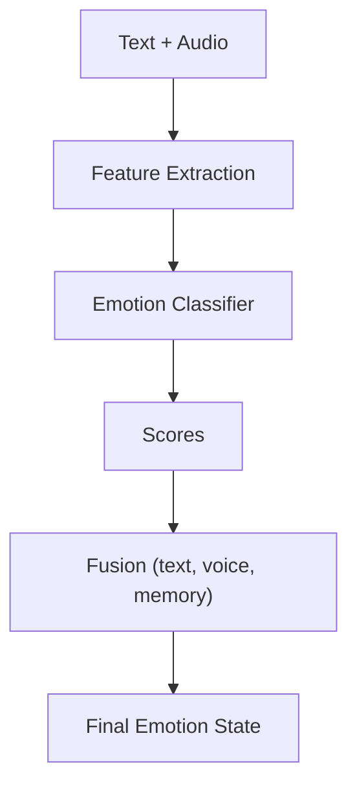

**Diagram sources**
- [voice_emotion_detector.py](file://psychologist/emotion_engine/voice_system/voice_emotion_detector.py)
- [emotion_fusion.py](file://psychologist/emotion_engine/voice_system/emotion_fusion.py)
- [voice_feature_extractor.py](file://psychologist/emotion_engine/voice_system/voice_feature_extractor.py)
- [voice_emotion_analyzer.py](file://psychologist/emotion_engine/voice_emotion/voice_emotion_analyzer.py)

**Section sources**
- [voice_emotion_detector.py](file://psychologist/emotion_engine/voice_system/voice_emotion_detector.py)
- [emotion_fusion.py](file://psychologist/emotion_engine/voice_system/emotion_fusion.py)
- [voice_feature_extractor.py](file://psychologist/emotion_engine/voice_system/voice_feature_extractor.py)
- [voice_emotion_analyzer.py](file://psychologist/emotion_engine/voice_emotion/voice_emotion_analyzer.py)
- [voice_config.yaml:21-27](file://psychologist/config/voice_config.yaml#L21-L27)

### TTS Engine Factory Pattern and Voice Selection
- TTS Manager implements a factory selecting Piper, eSpeak, or pyttsx3 based on availability and configuration
- Voice configuration defines voice ID, model paths, language, and safety constraints
- Voice Style Mapper adjusts prosody (speed, pitch, volume) according to detected emotion
- Voice Lock ensures consistent voice during synthesis bursts

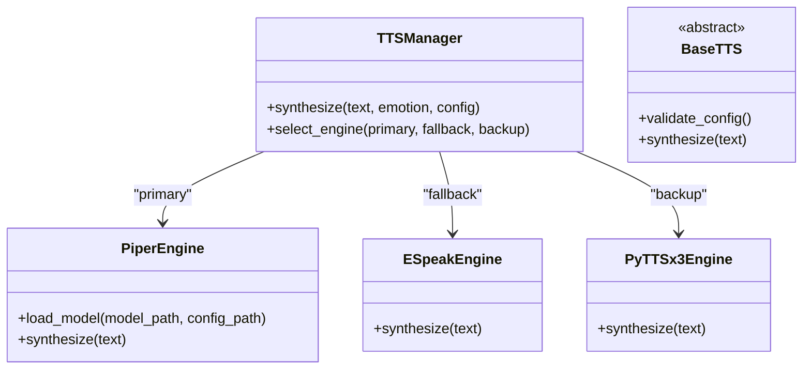

**Diagram sources**
- [tts_manager.py](file://psychologist/emotion_engine/voice_output/tts_manager.py)
- [base_tts_engine.py](file://psychologist/emotion_engine/voice_output/base_tts_engine.py)
- [piper_engine.py](file://psychologist/emotion_engine/voice_output/piper_engine.py)
- [espeak_engine.py](file://psychologist/emotion_engine/voice_output/espeak_engine.py)
- [pyttsx3_engine.py](file://psychologist/emotion_engine/voice_output/pyttsx3_engine.py)
- [voice_config.py](file://psychologist/emotion_engine/voice_output/voice_config.py)
- [voice_style_mapper.py](file://psychologist/emotion_engine/voice_output/voice_style_mapper.py)
- [voice_lock.py](file://psychologist/emotion_engine/voice_output/voice_lock.py)

**Section sources**
- [tts_manager.py](file://psychologist/emotion_engine/voice_output/tts_manager.py)
- [base_tts_engine.py](file://psychologist/emotion_engine/voice_output/base_tts_engine.py)
- [piper_engine.py](file://psychologist/emotion_engine/voice_output/piper_engine.py)
- [espeak_engine.py](file://psychologist/emotion_engine/voice_output/espeak_engine.py)
- [pyttsx3_engine.py](file://psychologist/emotion_engine/voice_output/pyttsx3_engine.py)
- [voice_config.py](file://psychologist/emotion_engine/voice_output/voice_config.py)
- [voice_style_mapper.py](file://psychologist/emotion_engine/voice_output/voice_style_mapper.py)
- [voice_lock.py](file://psychologist/emotion_engine/voice_output/voice_lock.py)
- [tts_config.yaml:1-10](file://psychologist/config/tts_config.yaml#L1-L10)
- [single_voice_tts.yaml:1-10](file://psychologist/config/single_voice_tts.yaml#L1-L10)

### Real-Time Audio Processing
- Microphone feeds audio chunks to preprocessing and VAD
- STT Manager coordinates engine selection and fallback
- Voice emotion detection enriches downstream synthesis with contextual prosody
- AudioPlayer handles output playback

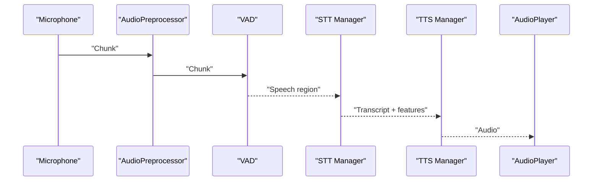

**Diagram sources**
- [microphone.py:14-95](file://psychologist/emotion_engine/voice_system/microphone.py#L14-L95)
- [audio_preprocessor.py:7-66](file://psychologist/emotion_engine/voice_system/audio_preprocessor.py#L7-L66)
- [vad.py:7-50](file://psychologist/emotion_engine/voice_system/vad.py#L7-L50)
- [stt_manager.py](file://psychologist/emotion_engine/voice_system/stt_manager.py)
- [tts_manager.py](file://psychologist/emotion_engine/voice_output/tts_manager.py)
- [audio_player.py](file://psychologist/emotion_engine/voice_output/audio_player.py)

## Dependency Analysis
- Configuration-driven coupling: voice_config.yaml, tts_config.yaml, single_voice_tts.yaml feed runtime behavior
- Low coupling between STT engines and TTS engines via manager abstractions
- Microphone and VAD are decoupled from engines; they provide raw audio and speech regions
- Voice emotion fusion depends on detector and feature extractor outputs
- TTS subsystem depends on voice configuration and style mapper

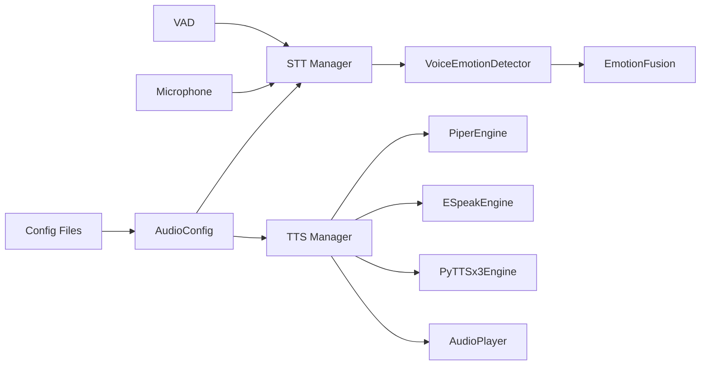

**Diagram sources**
- [audio_config.py:11-101](file://psychologist/emotion_engine/voice_system/audio_config.py#L11-L101)
- [stt_manager.py](file://psychologist/emotion_engine/voice_system/stt_manager.py)
- [tts_manager.py](file://psychologist/emotion_engine/voice_output/tts_manager.py)
- [microphone.py:14-95](file://psychologist/emotion_engine/voice_system/microphone.py#L14-L95)
- [vad.py:7-50](file://psychologist/emotion_engine/voice_system/vad.py#L7-L50)
- [voice_emotion_detector.py](file://psychologist/emotion_engine/voice_system/voice_emotion_detector.py)
- [emotion_fusion.py](file://psychologist/emotion_engine/voice_system/emotion_fusion.py)
- [piper_engine.py](file://psychologist/emotion_engine/voice_output/piper_engine.py)
- [espeak_engine.py](file://psychologist/emotion_engine/voice_output/espeak_engine.py)
- [pyttsx3_engine.py](file://psychologist/emotion_engine/voice_output/pyttsx3_engine.py)
- [audio_player.py](file://psychologist/emotion_engine/voice_output/audio_player.py)

**Section sources**
- [audio_config.py:11-101](file://psychologist/emotion_engine/voice_system/audio_config.py#L11-L101)
- [tts_config.yaml:1-61](file://psychologist/config/tts_config.yaml#L1-L61)
- [single_voice_tts.yaml:1-69](file://psychologist/config/single_voice_tts.yaml#L1-L69)
- [voice_config.yaml:1-28](file://psychologist/config/voice_config.yaml#L1-L28)

## Performance Considerations
- Sample rate and chunk size: align microphone and STT sample rates; smaller chunks reduce latency but increase CPU load
- Noise reduction strength: moderate values prevent artifacts while reducing background noise
- VAD aggressiveness: higher modes reduce false positives but risk missing fast speech
- Engine selection: Vosk is efficient for constrained environments; Whisper offers accuracy with higher compute
- Prosody mapping: keep style deltas small to avoid unnatural speech
- Disk I/O: disable raw audio saving in production; enable only for diagnostics

[No sources needed since this section provides general guidance]

## Troubleshooting Guide
- Microphone not detected or no audio:
  - Verify device enumeration and permissions
  - Check sample rate/channel settings match device capabilities
- Audio crackling or clipping:
  - Reduce input gain; ensure normalization prevents peaks
- Low STT accuracy:
  - Confirm language and model paths; prefer Vosk for constrained setups
  - Increase silence thresholds to avoid misclassification
- Emotion scores unstable:
  - Adjust confidence threshold and fusion weights
  - Validate feature extractor inputs and detector training
- TTS engine failures:
  - Confirm model paths and JSON configs for Piper
  - Ensure fallback engines are installed and functional
- Playback issues:
  - Verify audio device selection and buffer sizes
  - Disable auto-play temporarily to isolate problems

**Section sources**
- [microphone.py:14-95](file://psychologist/emotion_engine/voice_system/microphone.py#L14-L95)
- [audio_preprocessor.py:7-66](file://psychologist/emotion_engine/voice_system/audio_preprocessor.py#L7-L66)
- [vad.py:7-50](file://psychologist/emotion_engine/voice_system/vad.py#L7-L50)
- [stt_manager.py](file://psychologist/emotion_engine/voice_system/stt_manager.py)
- [piper_engine.py](file://psychologist/emotion_engine/voice_output/piper_engine.py)
- [espeak_engine.py](file://psychologist/emotion_engine/voice_output/espeak_engine.py)
- [pyttsx3_engine.py](file://psychologist/emotion_engine/voice_output/pyttsx3_engine.py)
- [audio_player.py](file://psychologist/emotion_engine/voice_output/audio_player.py)

## Conclusion
The Voice Processing System provides a robust, offline-first pipeline for speech recognition, emotion-aware synthesis, and real-time audio processing. Its modular design enables easy swapping of engines, precise control over privacy and safety, and extensible emotion fusion. With careful configuration and tuning, it delivers responsive, empathetic voice interactions suitable for sensitive applications.

[No sources needed since this section summarizes without analyzing specific files]

## Appendices

### Configuration Guides
- Voice and privacy defaults:
  - Set default STT/TTS engines, language, sample rate, and offline-only behavior
  - Control voice cloning and audio storage policies
- TTS modes and styles:
  - Choose single-voice or multi-engine modes
  - Configure emotion-based prosody scaling and safety constraints
- Single-voice configuration:
  - Define voice model and JSON config paths, language, and locking behavior
- Interaction modes:
  - Enable/disable voice/text/hybrid modes and configure timeouts and limits
- Safety keywords and templates:
  - Define crisis detection keywords and safe response templates

**Section sources**
- [voice_config.yaml:1-28](file://psychologist/config/voice_config.yaml#L1-L28)
- [tts_config.yaml:1-61](file://psychologist/config/tts_config.yaml#L1-L61)
- [single_voice_tts.yaml:1-69](file://psychologist/config/single_voice_tts.yaml#L1-L69)
- [interaction_config.yaml:1-60](file://psychologist/config/interaction_config.yaml#L1-L60)
- [safety_config.yaml:1-116](file://psychologist/config/safety_config.yaml#L1-L116)

### Example Integrations
- Initialize STT with Vosk primary and Whisper fallback, then synthesize with emotion-aware prosody
- Capture microphone audio, preprocess, detect speech regions, transcribe, and produce a tailored voice response
- Configure a locked single voice with specific model files and safety constraints

**Section sources**
- [stt_manager.py](file://psychologist/emotion_engine/voice_system/stt_manager.py)
- [tts_manager.py](file://psychologist/emotion_engine/voice_output/tts_manager.py)
- [voice_config.py](file://psychologist/emotion_engine/voice_output/voice_config.py)
- [voice_style_mapper.py](file://psychologist/emotion_engine/voice_output/voice_style_mapper.py)